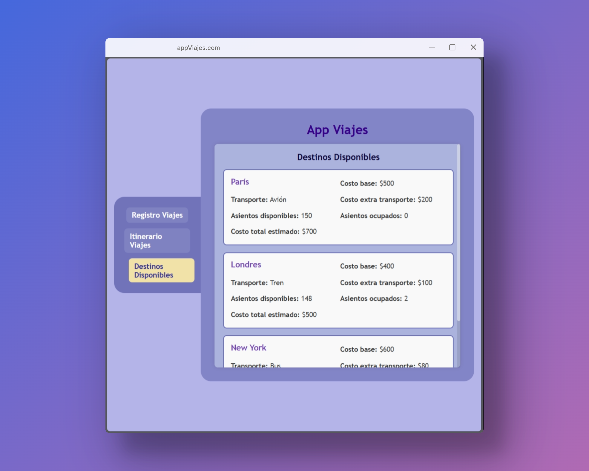

# App de Gestión de Viajes
Aplicación web para planificación y gestión de viajes, con registro de reservas, validación de disponibilidad y visualización de itinerarios.

## Uso con Servidor Local:
1. **Requisito**
   - Para el funcionamiento de los módulos ES6 se recomienda usar la extensión de [Live Server](https://marketplace.visualstudio.com/items?itemName=ritwickdey.LiveServer) en **VSCode**

3. **Ejecutar el proyecto**:
    -   Abrir `home.html`
    -   Click derecho en el editor > **"Open with Live Server"**
    -   Se abrirá automáticamente en `http://localhost:5500`

## Uso Básico
Navegación de la aplicación con un menú interactivo:

**1. Registro de Viajes**: 
-   Seleccionar destino y transporte (se autocompleta)
-   Ingresar fecha y cantidad de boletos
-   Mensaje de validación y costo calculado

 

**2. Consultar itinerario**
-   Revisar lista de viajes registrados
-   Identificar reservas válidas e inválidas

 

**3. Explorar Destinos**
-   Ver detalles completos de cada destino
-   Monitorear disponibilidad de asientos

 

## 1. Gestión de Datos: 
  - Sistema de clases ES6
  - Modelos para destinos, transportes y viajes

## 2. Módulos ES6
```javascript
// Ejemplo en app.js
import { Viajes } from "./viajes.js";
import { destinos } from "./destinos.js";
```

## 3. Clases ES6
```javascript
// Ejemplo en transportes.js
export class Transporte {
    constructor(tipo, costoExtra) {
        this.tipo = tipo;
        this.costoExtra = costoExtra;
    }

    //Método de instancia
    mostrarTransporte() {
        console.log(`Tipo: ${this.tipo} - Costo Extra: ${this.costoExtra}`);
    }
}
```

### Aplicación en el proyecto:
- Modelado de entidades (Destino, Transporte, Viajes)
- Métodos de instancia (mostrarTransporte(), mostrarDestinos(), validarViajes(), etc.)

## 4. Arrow Functions
```javascript
// Ejemplo en viajes.js
calcularCosto = () => {
  // Lógica de cálculo...
}
```

## 5. Métodos de Array
```javascript
// Ejemplo en validarViaje()
const destinoFinal = destinos.find(d => d.destino === this.destino);
```
- `.find()` para búsquedas
- `.forEach()` para iteraciones

## Estructura 
- `appTravel.js`: Uso de DOM y frontend
- `app.js`: Punto de entrada
- `viajes.js`: Lógica de reservas y validaciones
- `destinos.js`: Modelado y  datos de destinos
- `transportes.js`: Modelado y datos de transportes
